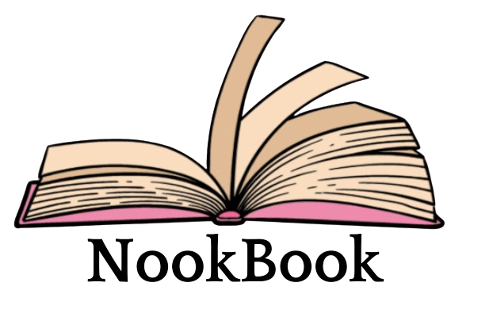

# NookBook - *Your perfect nook for every book!*

**Bem-vindo(a) ao repositório oficial do NookBook!**  
Este projeto foi desenvolvido no âmbito da unidade curricular de **Projeto e Desenvolvimento Informático**, inserida na **Licenciatura em Informática de Gestão** da **Coimbra Business School | ISCAC**.
O NookBook é uma plataforma digital concebida para apaixonados por leitura que desejam organizar, acompanhar e enriquecer a sua experiência literária — tudo num ambiente interativo, gamificado e visualmente apelativo.

## 📖 Sobre o NookBook

O **NookBook** é uma plataforma digital dedicada à **gestão de leituras**, combinando funcionalidades práticas com **elementos de gamificação**. Através do NookBook, os utilizadores podem organizar os seus livros, acompanhar o progresso de leitura, escrever avaliações, e participar em desafios motivacionais.  
Foi pensado como um espaço personalizado e motivador para leitores de todos os níveis, promovendo o hábito da leitura de forma leve, intuitiva e interativa.

## 🎯 Objetivo do Projeto

Criar um website funcional e visualmente apelativo que:

- Permita **organizar leituras** em estantes personalizadas
- Registe o **progresso e histórico** de leitura
- Ofereça funcionalidades de **avaliação e comentários**
- Inclua desafios e a **"Roda da Sorte"** para incentivar a leitura
- Seja **totalmente responsivo**, adaptando-se a qualquer dispositivo

## ✔️ Funcionalidades Implementadas

- **Registo e Autenticação** (com opção de *Guest Mode*)
- **Perfil do utilizador** com edição de nome, biografia e imagem de perfil
- **Adição de livros**
- **Gestão de biblioteca pessoal**, com estantes como "A Ler", "Lidos", "Quero Ler" e personalizadas
- **Atualização de progresso de leitura**
- **Histórico de leituras**
- **Sistema de comentários e avaliações**
- **Visualização de desafios**
- **Roda da Sorte** (escolha aleatória de livro para ler)
- **Responsividade**

## 🛠️ Tecnologias Utilizadas

- **Django**: Framework utilizado por ser robusta, simples de usar e ideal para construir *websites*.
- **HTML5, CSS3 & JavaScript**: Garantem uma interface estruturada, visualmente agradável e interativa.
- **Google Books API**: Fornece dados enriquecidos sobre livros, como título, autor, imagem da capa e sinopse.
- **SQLite**: Base de dados leve e integrada com o Django.
- **GitHub**: Controlo de versões, colaboração e disponibilização do repositório.
- **Trello**: Planeamento, distribuição de tarefas e gestão ágil do projeto.
